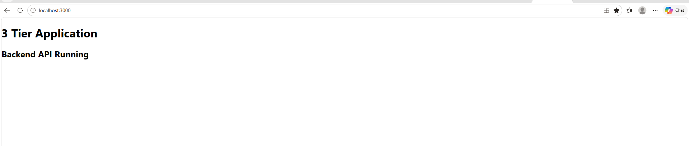
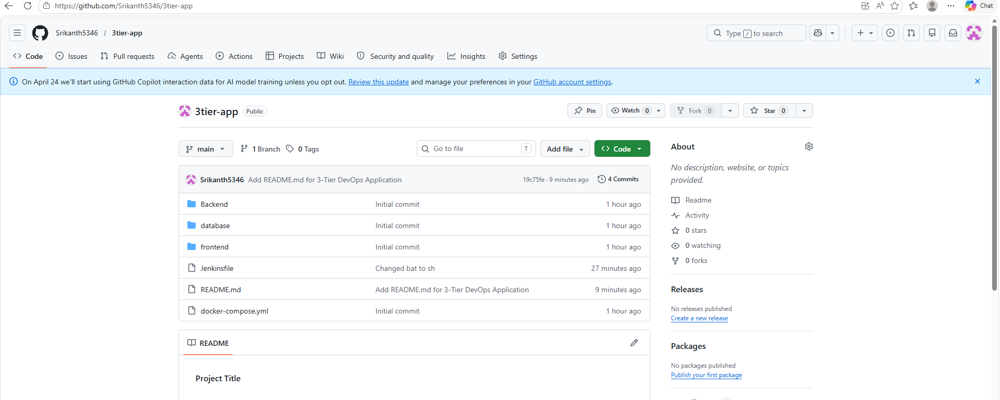

# 3-Tier DevOps Application

## Project Overview
This project is a 3-tier application using:
- React frontend
- Node.js backend
- MySQL database
- Docker & Docker Compose
- Jenkins CI/CD pipeline
- GitHub integration

---

## Architecture

Frontend (React)
↓
Backend API (Node.js + Express)
↓
MySQL Database

---

## Tools Used

- React
- Node.js
- Express
- MySQL
- Docker
- Docker Compose
- Jenkins
- GitHub

---

## Docker Commands

Start containers:

```bash
docker compose up --build
```

Stop containers:

```bash
docker compose down
```

Check running containers:

```bash
docker ps
```

---

## Jenkins Pipeline Flow

1. Pull code from GitHub
2. Build Docker images
3. Deploy containers
4. Verify running containers

---

## Screenshots

- Frontend running

- Docker containers

- Jenkins pipeline

- GitHub repository
https://github.com/Srikanth5346/3tier-app


---

## Author

Vadithya Srikanth